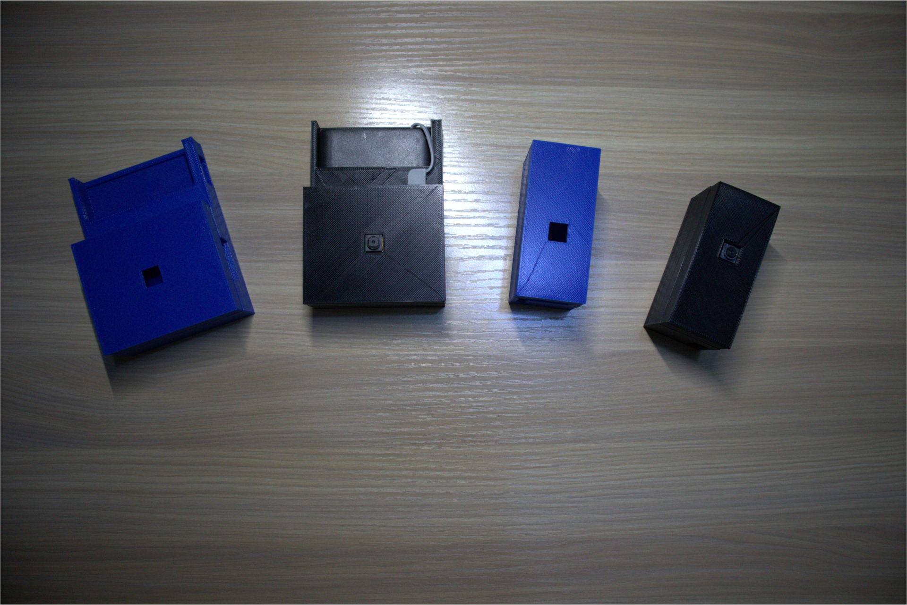
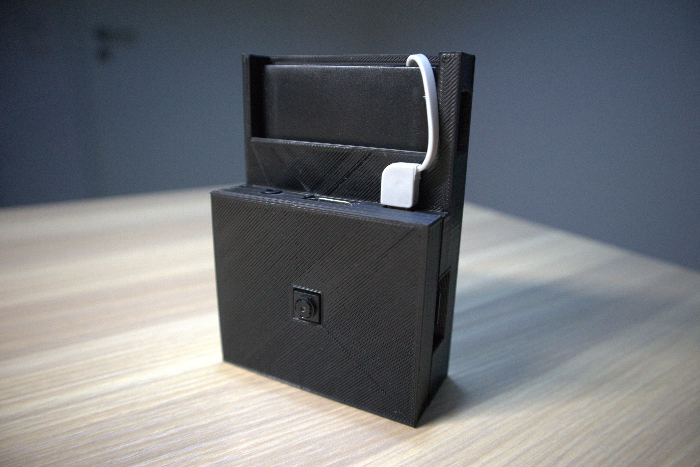
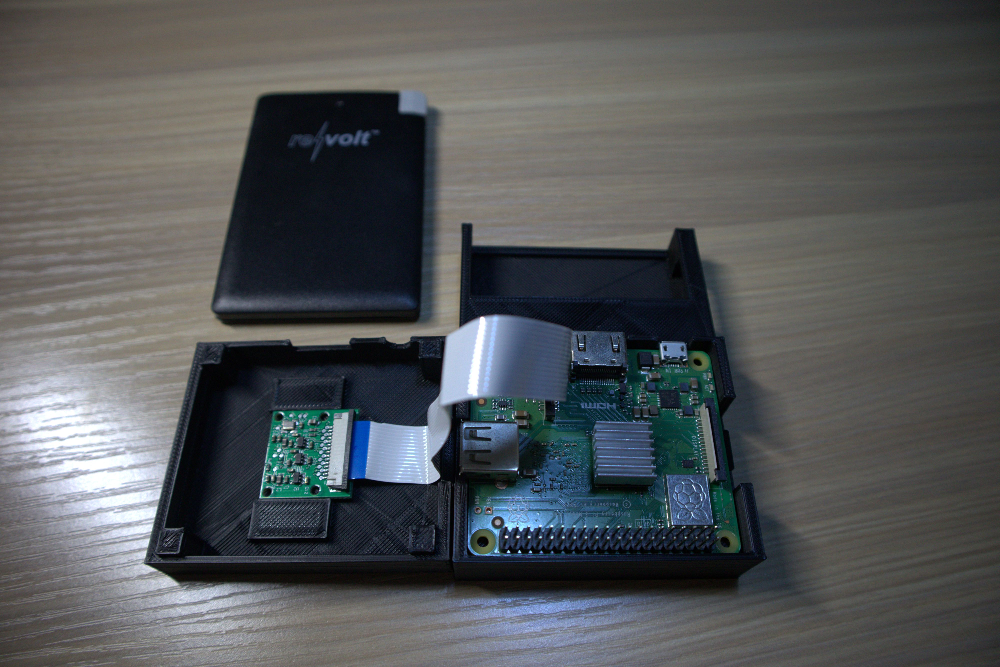
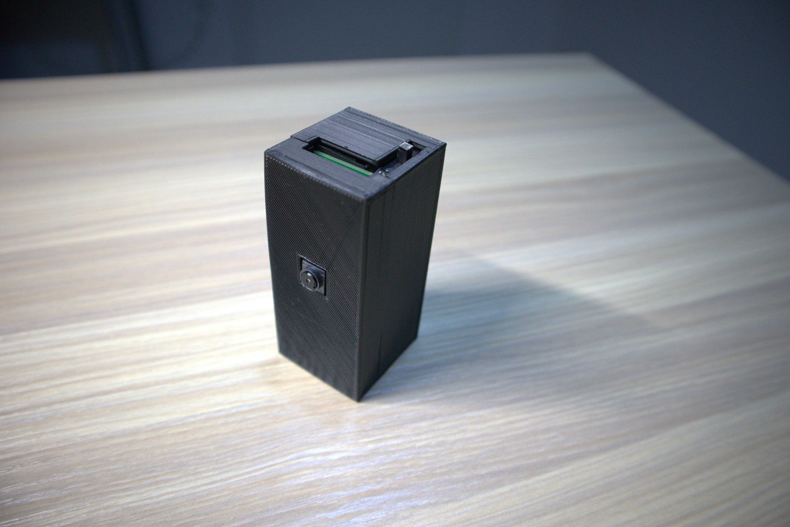
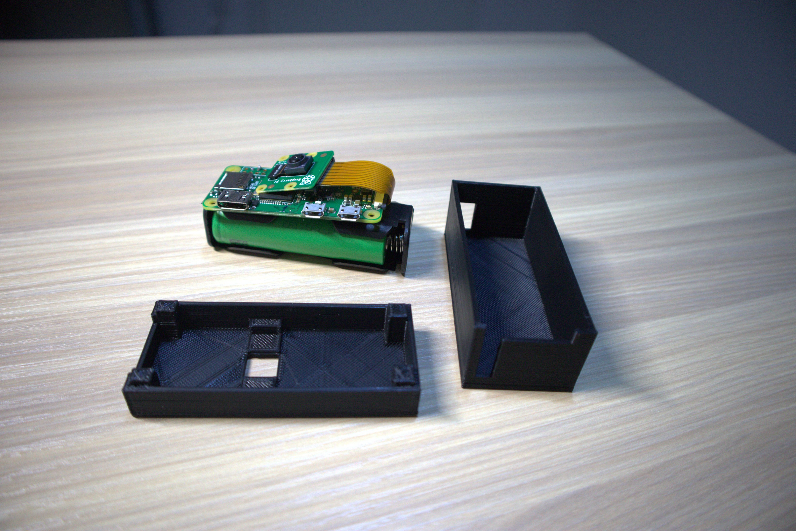

# Portable-PiCam
3D printable case for a portable Raspberry Pi solution

Make your Raspberry Pi projects portable and compact with this 3D printable cases. These cases have been designed to integrate a Raspberry Pi, a Pi camera and a battery to power ewerything up. This is an ideal solution if you want to create a surveillance system without unconfortable wires around. Check out my website for build instructions and necessary components [here](https://davidforino-aisolutions.com/raspberry-pi-surveillance-system/).

